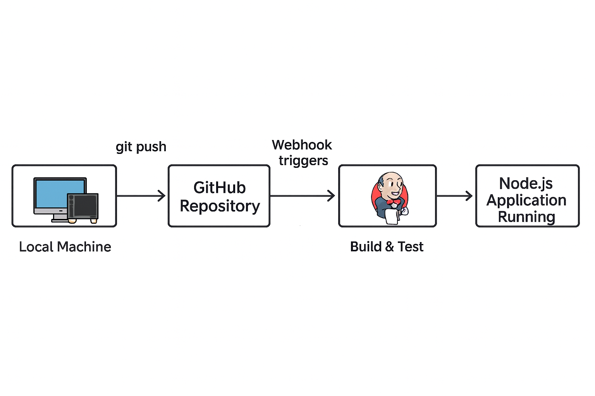

# node-deployment-using-CICD-pipeline

## About This Project

This project shows how to deploy a Node.js application to an AWS EC2 instance using a Jenkins CI/CD pipeline.  
Whenever code is pushed to GitHub, Jenkins automatically pulls the latest changes, installs dependencies, and deploys the updated app on the Node.js server.

---

## Architecture

The overall flow of the CI/CD pipeline is shown below:



---

## Tools & Services Used

- **AWS EC2** – Hosts Jenkins and the Node.js application
- **GitHub** – Version control for application source code
- **Jenkins** – Automates build and deployment pipeline
- **Node.js & npm** – Runtime for the application
- **PM2** – Process manager to keep the Node app running in background
- **Ubuntu** – Operating system for both servers

---

## Step-by-Step Setup

### Step 1: Launch EC2 Instances

Create **two** EC2 instances:

1. **Jenkins Server**
2. **Node.js Application Server**

For both instances:

- Choose **Ubuntu** as OS
- Configure Security Group to allow:
  - **22** – SSH
  - **8080** – Jenkins UI (Jenkins server)
  - **3000** – Node.js application (Node server)

---

### Step 2: Install Required Packages

#### On Node.js Server

```bash
sudo apt update
sudo apt install -y git
sudo apt install -y nodejs npm
sudo npm install -g pm2
(Optionally, check versions with node -v, npm -v.)

---

### Step 3: Push Code to GitHub

On local machine:

```bash
git add .
git commit -m "Initial commit - Node.js CI/CD setup"
git push -u origin main   #or master

### Step 4: Configure Jenkins Job

- Install Jenkins plugins: **Git**, **SSH Agent**, **Pipeline**
- Add SSH credentials for the **Node.js EC2 server**
- Create job **`node-app-deployment`** (Pipeline/Freestyle)
- Set **GitHub repo URL** and use the `jenkinsfile` from this repo

Pipeline (high level): SSH to Node server → pull latest code → `npm install` → start/restart app with **PM2**.


### Step 5: Deployment & Verification

After the Jenkins job runs, it:

- SSHs into the **Node.js EC2** server  
- Pulls the latest code and installs dependencies  
- Starts the app with **PM2**, e.g.:


